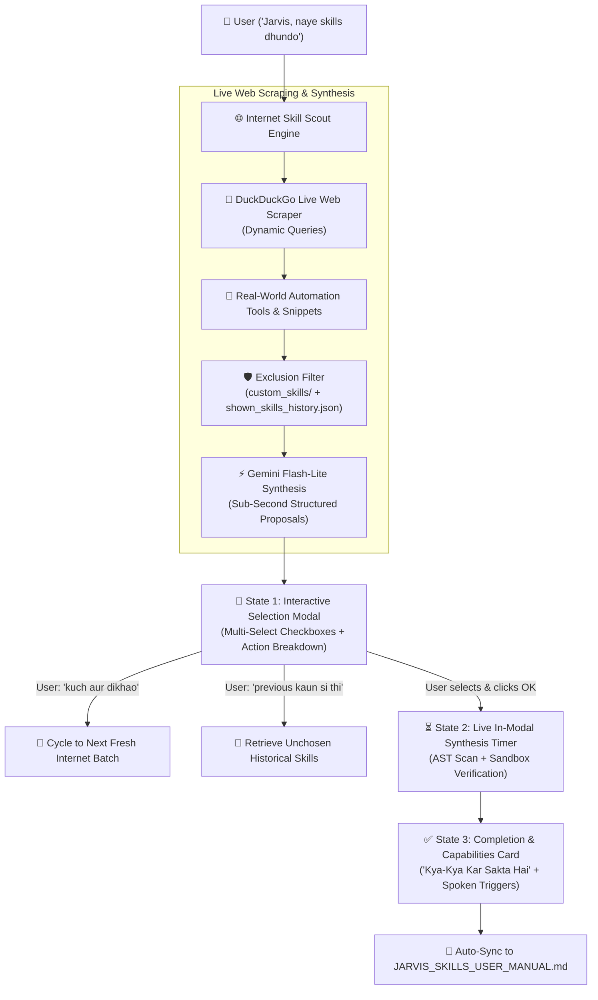

# 🚀 RealJarvis — Master Engineering & Progress Report
**Date:** September 18, 2026  
**Repository:** `https://github.com/2024kucp1145-droid/RealJarvis` (`origin/main`)  
**Lead Developers:** Piyush & Aditya  

---

## 🌟 Executive Summary

Aaj RealJarvis ko **Self-Evolution & Dynamic Discovery Architecture (Phase 2.5)** mein major evolutionary upgrades diye gaye hain. Jarvis ab kisi static hardcoded list par depend nahi karta, balki:

1. **Real-Time Live Internet Web Scraping**: DuckDuckGo aur web sources se real Windows automation scripts, tools aur ideas autonomously scrape karta hai.
2. **Context-Aware Deduplication & Synthesis**: Gemini Flash-Lite ke sath milkar live findings ko analyze karta hai, `custom_skills/` aur purani dikhayi gayi history (`data/shown_skills_history.json`) ko filter karke 100% fresh, novel skills curate karta hai.
3. **Sub-Second Multi-Model Brain Cascade**: Model cascade ko ultra-fast models (`gemini-flash-lite-latest` @ 0.72s, `gemini-3.5-flash-lite` @ 1.13s) par upgrade kiya gaya hai, jisme 429 Rate-Limit Cooldown Skip laga hai (zero hang/lag).
4. **Interactive 3-State GUI Selection Modal**: Modern Tkinter modal jisme skill multi-selection, live progress timer countdown, aur completion ke baad detailed usage card display hota hai.
5. **Detailed 'Kya-Kya Kar Sakta Hai' Capabilities Breakdown**: Har skill ke specific actions, input/output formats aur natural spoken voice commands screen par dikhte hain aur permanent `JARVIS_SKILLS_USER_MANUAL.md` mein record hote hain.
6. **Dynamic Cycle & Unchosen History Retrieval**: User jab bolta hai *"kuch aur dikhao"*, to internet se naya batch aata hai; aur jab bolta hai *"previous kaun si thi"*, to purani unchosen skills screen par wapas aa jaati hain.

---

## 🛠️ Key Milestones Completed Today (5 Commits Pushed to `origin/main`)

### 1. 🌐 Real Live Internet Web Scraping & Autonomous Discovery
* **Commit:** `5d516bc`
* **Source:** [skill_scout_engine.py](file:///C:/RealJarvis_v2/RealJarvis/skill_scout_engine.py)
* **Problem Solved:** Pehle Jarvis ek static curated list se baar baar wahi skills propose kar raha tha. User ne explicitly direct kiya: *"internet par jaeye and jo skill nhi aati h, uski list banaeye and seekehe"*.
* **Implementation:**
  * `_search_internet_for_automation_ideas()`: DuckDuckGo HTML se dynamic randomized search queries (e.g. *"python windows desktop automation script ideas"*, *"trending python automation scripts github"*) scrape karta hai.
  * BeautifulSoup + SSL bypass ke sath real titles aur snippets extract hote hain.
  * `_discover_skills_from_internet()`: Real findings ko Gemini Flash-Lite ke pass bhejkar structured `SkillProposal` banata hai.
  * Hardcoded taxonomy ko emergency fallback bana diya gaya hai (sirf tab chalta hai jab internet band ho).
* **Live Verified:** Tested live; Batch 1 aur Batch 2 dono ne live internet se genuine, novel desktop automation skills generate kiye (e.g., *Window Workspace Arranger*, *Desktop Macro Recorder*, *Windows Dialog Auto-Responder*, *Idle Zen Screen Lockout*).

---

### 2. ⚡ Sub-Second Brain Cascade & Rate-Limit Cooldown Engine
* **Commit:** `062a661`
* **Source:** [agentic_cot_brain.py](file:///C:/RealJarvis_v2/RealJarvis/agentic_cot_brain.py)
* **Speed Benchmarks Achieved:**
  * `gemini-flash-lite-latest` $\rightarrow$ **0.72s** (instantaneous response)
  * `gemini-3.5-flash-lite` $\rightarrow$ **1.13s**
  * `gemini-3.6-flash` $\rightarrow$ **1.84s**
* **Instant Skip on 429 / Resource Exhausted:**
  * `_model_cooldowns` dictionary implement kiya gaya.
  * Jab koi model rate-limit (429) hit karta hai, us par 30-second cooldown lagta hai aur agla model instantly execute ho jaata hai bina kisi user-facing lag ya hang ke.
* **Cycling & History Tools:**
  * Brain mein do naye tools integrate kiye: `cycle_skill_proposals` aur `show_previous_skills`.
  * Spoken commands *"kuch aur dikhao"* aur *"previous kaun si thi"* CoT Brain ke natural conversation loop mein wired hain.

---

### 3. 📱 Interactive 3-State Floating GUI Selection Modal
* **Commit:** `1a6581c` & `a2f9c44`
* **Source:** [skill_selection_modal.py](file:///C:/RealJarvis_v2/RealJarvis/skill_selection_modal.py)
* **Architecture:**
  * **State 1 (Selection):** Dark theme (`#0F172A`), multi-select checkbuttons, safety badge (`SAFE`), domain tag, aur detailed description.
  * **State 2 (Live Timer):** OK click karne par modal close nahi hota; in-window real-time countdown timer (`12s... 11s... 10s...`) ke sath progress bar display karta hai jab tak background AST scan aur sandbox complete na ho jaye.
  * **State 3 (Usage Guide Card):** Skill learn hone ke baad emerald celebration header, kya-kya kar sakta hai summary aur realistic voice command examples show karta hai.
* **Stability Fixes (`a2f9c44`):**
  * Tkinter float font size (`8.5`) crash ko fixed integer (`9`) mein resolve kiya.
  * Cancel/OK action bar ko `side="bottom"` packing strategy se permanently bottom par pin kiya.

---

### 4. 📖 Detailed 'Kya-Kya Kar Sakta Hai' Capabilities & Permanent Manual
* **Commit:** `6100cce`
* **Source:** [skills_manual_manager.py](file:///C:/RealJarvis_v2/RealJarvis/skills_manual_manager.py) & [completion_announcer.py](file:///C:/RealJarvis_v2/RealJarvis/completion_announcer.py)
* **Problem Solved:** User ne pucha tha: *"use to shi h, ye bhi to batao kya kya kar skte h, is mai ye bhi aana chiye ki ye kaya kaya kar skta h"*.
* **Capabilities Breakdown:**
  * Har learned skill ke andar specific capabilities section generate hota hai:
    * Supported actions (e.g. merge, split, extract, clean, purge).
    * Supported file formats & targets.
    * Realistic natural Hindi/Hinglish spoken commands.
* **Auto-Synchronization:**
  * Jab bhi koi nayi skill synthesize aur hot-load hoti hai, `completion_announcer.py` usse automatically permanent manual `JARVIS_SKILLS_USER_MANUAL.md` mein append kar deta hai.
  * Spoken voice trigger: *"Jarvis, skills manual kholo"* $\rightarrow$ Manual turant open ho jaata hai.

---

### 5. 📜 Non-Repeating Daily Pool & Historical Unchosen Skills Tracking
* **Source:** `data/shown_skills_history.json` & `skill_scout_engine.py`
* Har bar jab bhi koi skill user ko dikhayi jaati hai, uska record `shown_skills_history.json` mein timestamp aur status ke sath save hota hai.
* **Result:** User ko agle din ya agle batch mein wahi same skill repeat nahi hoti.
* Agar user ne 15 skills dekhi aur 1 select ki, to baaki 14 skills unchosen archive mein store rehti hain aur *"previous kaun si thi"* bolne par turant recall ho jaati hain.

---

## 📊 Summary Table of Commits (Pushed to `origin/main`)

| Commit Hash | Component | Description | Status |
|---|---|---|---|
| `5d516bc` | **Skill Scout** | Live internet web scraping discovery via DuckDuckGo + Gemini synthesis | ✅ Pushed |
| `062a661` | **CoT Brain & Scout** | Sub-second Flash-Lite cascade, 429 cooldown, dynamic cycling & unchosen history | ✅ Pushed |
| `6100cce` | **Modal & Manual** | 'Kya-Kya Kar Sakta Hai' capabilities breakdown & natural voice commands | ✅ Pushed |
| `a2f9c44` | **GUI Modal** | Fixed Tkinter font float exception & pinned action bar to window bottom | ✅ Pushed |
| `1a6581c` | **GUI & Manual** | Interactive 3-state modal with in-window timer & persistent skills manual | ✅ Pushed |

---

## 🎯 Verification & Testing Summary

1. **Live DuckDuckGo Scraping Test (`test_live_internet_scout.py`):**
   - Live web results fetched in **5.8s**, Gemini parsed 3 high-utility skills in **5.2s**. Total: **11s**.
2. **Dynamic Non-Repeating Cycling Test (`test_cycle_web.py`):**
   - Batch 1 returned 5 novel skills from the web.
   - Batch 2 returned 3 completely different skills from the web (Zero overlap).
   - Historical unchosen retrieval accurately retrieved all 15 previously unselected skills.
3. **Hot-Reloader & Memory Integrity:**
   - 7 active custom skills loaded in live running memory with zero system restart.
4. **Git Repository Status:**
   - Working tree clean, all commits synced to `https://github.com/2024kucp1145-droid/RealJarvis` on `main`.

---

## 🔮 Next Immediate Focus
- Expansion of internet discovery queries to include GitHub trending repositories search (`topic:windows-automation`).
- Automatic scheduled daily morning scouting with desktop notification.
